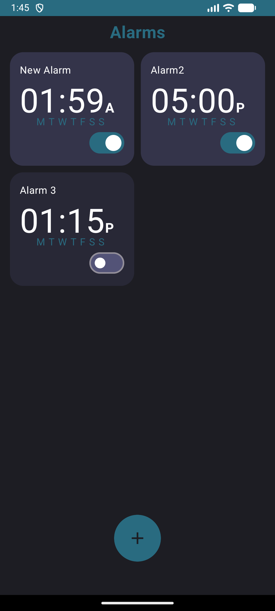
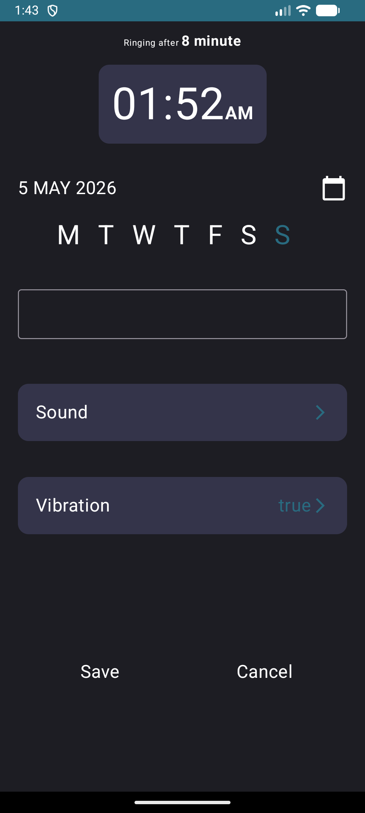
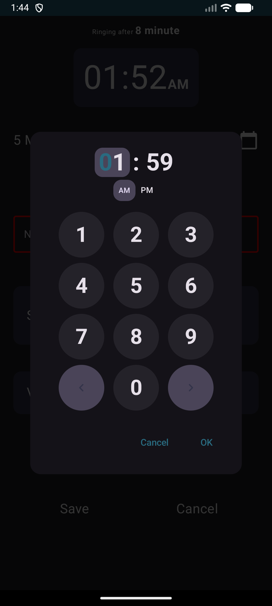
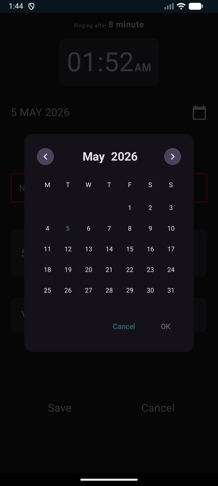

# Alarm Me ⏰

Alarm Me is a modern, intuitive alarm clock application for Android built with Jetpack Compose. It offers a clean interface for managing your daily alarms with advanced features like date selection and repeat patterns.

## Features ✨

- **Modern UI**: Built entirely with Jetpack Compose for a smooth and responsive experience.
- **Advanced Scheduling**: Set alarms for specific dates or recurring days of the week.
- **Customization**: Choose your favorite ringtones and toggle vibration.
- **Clean Architecture**: Follows best practices with separated Domain, Data, and Presentation layers.
- **Local Storage**: Uses Room database to store and manage your alarms efficiently.
- **Dependency Injection**: Powered by Hilt for robust and testable code.

## Screenshots 📸

| Main Screen | Alarm Setup |                        Time Picker                         | Date Picker |
| :---: | :---: |:----------------------------------------------------------:| :---: |
|  |  |  |  |

## Tech Stack 🛠️

- **Language**: Kotlin
- **UI Framework**: Jetpack Compose
- **Dependency Injection**: Hilt
- **Database**: Room
- **Architecture**: MVVM + Clean Architecture
- **Libraries**:
    - Navigation Compose
    - Lifecycle (ViewModel, Compose)
    - Sheets Compose Dialogs (Calendar & Clock pickers)
    - Coroutines & Flow

Created by [Muhammad Ali](https://github.com/MuhammadAli251018)
